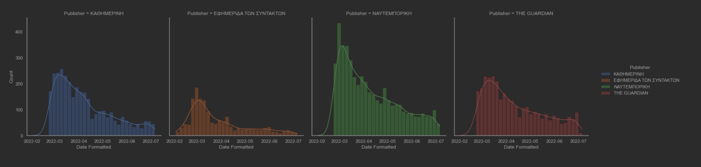

# 132 War Days Dataset
> This repository is the result of an academic research in Data Science field during a postgraduate course at the UOA University of Athens

This dataset created by scraping from various journal web domains based on Europe.  
### Origin
| Publisher    | Number of articles | Comments | Lang |
|:-------------|:-------------------|----------|------|
| NAFTEMPORIKI | 4628               | `NaN`    | `el` |
| KATHIMERINI  | 3230               | `NaN`    | `el` |
| EFSYN        | 2400               | `NaN`    | `el` |
| THE GUARDIAN | 3205               | 67478    | `en` |

### Number of articles
The dataset contains **13463** articles

Also there are chunk fragments that contain **73944** Tweets in total and **67478** comments from The Guardian with relation to articles on primary dataset
### Variables
There are **19** attributes in each case of the dataset
## Dataset

| Keys                 | Value                                                                                                                                                                                                | Dtype            |
|:---------------------|:-----------------------------------------------------------------------------------------------------------------------------------------------------------------------------------------------------|------------------|
| **Publisher**        | `THE GUARDIAN` `KATHIMERINI` `EFSYN` `NAFTEMPORIKI`                                                                                                                                                  | _category_       |
| **Date Formatted**   | `2022-02-23`                                                                                                                                                                                         | _datetime64[ns]_ |
| **Lang**             | `en/el`                                                                                                                                                                                              | _category_       |
| **Heading**          | `Russia-Ukraine war: what we...`                                                                                                                                                                     | _string_         |
| **Tag**              | `WORLD` `POLITICS` `BOOKS` `...`                                                                                                                                                                     | _category_       |
| **Text**             | `Not long ago, Brexit Britain was the bad boy of Europe. Then it was Poland’s turn, its rightwing leadership likewise excoriated for defying the Brussels establishment. Now, after the invasion...` | _string_         |
| **Comments exist**   | `True` `False`                                                                                                                                                                                       | _bool_           |
| **Comments count**   | `7064`                                                                                                                                                                                               | _int32_          |
| **Comments api key** | `/p/kz3fp`                                                                                                                                                                                           | _string_         |
| **Article url**      | `https://www.theguardian.com/politics/live/2022/feb/23/uk-politics...`                                                                                                                               | _string_         |
| **Chars**            | `18673`                                                                                                                                                                                              | _int64_          |
| **Words**            | `3017`                                                                                                                                                                                               | _int64_          |
| **Year**             | `2022`                                                                                                                                                                                               | _int16_          |
| **Month**            | `2`                                                                                                                                                                                                  | _int8_           |
| **Day**              | `23`                                                                                                                                                                                                 | _int8_           |
| **Lemma**            | `long ago brexit britain bad boy europe poland turn rightwing leadership likewise excoriate defy brussels establishment invasion...`                                                                 | _string_         |
| **Lemma_unique**     | `437`                                                                                                                                                                                                | _int64_          |
| **Sentiments**       | `negative` `neutral` `positive`                                                                                                                                                                      | _category_       |
| **Positivity**       | `0.219`                                                                                                                                                                                              | _int64_          |
| **Negativity**       | `0.089`                                                                                                                                                                                              | _int64_          |

## Import dataset
```python
import pandas as pd

war = pd.read_csv('../data/processed/132-war-days.csv',
                  compression={'method': 'gzip',
                               'compresslevel': 1,
                               'mtime': 1},
                  index_col=[0])
```
## Project structure
````
├── data
│   └── final 
│       └── 132-war-days-zip.csv
│   ├── images
│   ├── intermediate
│   ├── nrc
│   ├── old
│   ├── processed
│   └── raw
│
├── docs
│   ├── src 
│   └── index.html
│   
├── notebooks
│   ├── dataAnalysisVisualization.ipynb
│   ├── dataImportTransform.ipynb
│   ├── dataMerge.ipynb
│   ├── dataOptCleaning.ipynb
│   ├── dataTesting.ipynb
│   ├── dataTweets.ipynb
│   ├── guardianComments.ipynb
│   └── sentimentAnalysis.ipynb
│
├── reports
│   └── ***.png
│   
├── src
│   ├── helpers
│   │   └── utilities.py
│   │ 
│   ├── plots
│   │   └── cloud.py
│   │  
│   ├── prototypes
│   │   ├── browser.py 
│   │   ├── datamodel.py 
│   │   ├── endpoints.py 
│   │   └── twitterapi.py
│   │ 
│   ├── scrapers
│   │   ├── comments.py 
│   │   ├── efsyn.py 
│   │   ├── guardian.py 
│   │   ├── guardian-old.py 
│   │   ├── images.py 
│   │   ├── kathimerini.py 
│   │   ├── naftemporiki.py 
│   │   ├── scrapeajax.py 
│   │   ├── scrapescroll.py 
│   │   └── tweets.py
│   │                    
│   └── app.py 
│             
├── .gitignore
├── .env
└── README.md
````

## Run the guardian scraper
````shell
$ cd src/scrapers
````
````shell
$ source /venv/bin/activate
````
````shell
$ python guardian.py
````
## Plots

_Scatter plot describes linear relations between negativity and positivity variables_





